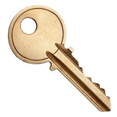

# KeyPhrase



KeyPhrase generator for the [EARTH Network](https://www.earth.engineering). KeyPhrases are human readable backup phrases which contain most of the information needed to recreate your EARTH addresses.

For more info check out the [KeyPhrase Specification](https://github.com/EarthEngineering/keyphrase/wiki/KeyPhrase-Specification)

```rust
    println!("English:");
    let keyphrase = KeyPhrase::new(KeyPhraseType::Words12, Language::English);
    let phrase: &str = keyphrase.phrase();
    println!("KeyPhrase: {}", phrase);

    // get the HD wallet seed
    let seed = Seed::new(&keyphrase, "");
    println!("Root Seed: {:X}", seed);
    println!("----------");

    // English:
    // KeyPhrase: habit treat fringe blouse jump tomato hello become more planet list rhythm
    // Root Seed: 1CD312DB19E0644921616B0E44B4051F2FB5D19567D4866B7AF6C7676746F94FE0E49355397BBF53659882FB928C4DF3AABD32327E88AD732770CE21ECC20
    // ----------

    println!("Korean:");
    let keyphrase = KeyPhrase::new(KeyPhraseType::Words12, Language::Korean);
    let phrase: &str = keyphrase.phrase();
    println!("KeyPhrase: {}", phrase);
    println!("----------");

    // Korean:
    // KeyPhrase: 안부 모니터 장애인 대출 지원 본격적 서적 다행 관점 부족 유치원 갈비
    // ----------

    println!("Italian:");
    let keyphrase = KeyPhrase::new(KeyPhraseType::Words12, Language::Italian);
    let phrase: &str = keyphrase.phrase();
    println!("KeyPhrase: {}", phrase);
    println!("----------");

    // Italian:
    // KeyPhrase: meno elevare diploma tralcio montato servire gittata certo garbo ombelico sfumare sguardo
    // ----------

    println!("Chinese Traditional:");
    let keyphrase = KeyPhrase::new(KeyPhraseType::Words24, Language::ChineseTraditional);
    let phrase: &str = keyphrase.phrase();
    println!("KeyPhrase: {}", phrase);
    println!("----------");

    // Chinese Traditional:
    // KeyPhrase: 廟 牙 錢 療 健 董 疆 胸 冊 弱 幾 凍 改 喬 叔 冷 山 慘 溝 呵 長 趨 鋪 跳
```

## Word Lengths

Variable length KeyPhrases are supported from 12 to 24 words and 128 bits to 256 bits respectively. Defaults is 12 words/128 bits.

- 12 (128 bits)
- 15 (160 bits)
- 18 (192 bits)
- 21 (224 bits)
- 24 (256 bits)

## Languages

KeyPhrase supports 8 languages and defaults to English.

- [English](./src/langs/english.txt)
- [Spanish](./src/langs/spanish.txt)
- [Italian](./src/langs/italian.txt)
- [French](./src/langs/french.txt)
- [Korean](./src/langs/korean.txt)
- [Japanese](./src/langs/japanese.txt)
- [Chinese Simplified](./src/langs/chinese_simplified.txt)
- [Chinese Traditional](./src/langs/chinese_traditional.txt)

## Documentation

Full docs are available via

```
cargo doc --no-deps --open
```

## Acknowledgments

This project was originally forked from [bip39-rs](https://github.com/infincia/bip39-rs). Thanks to that team for an amazing project! 🎩
